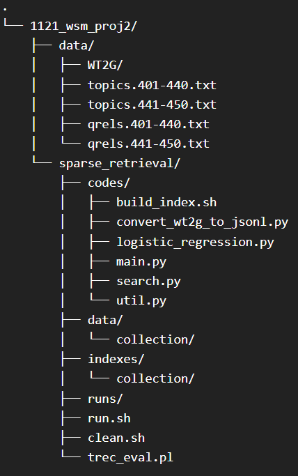
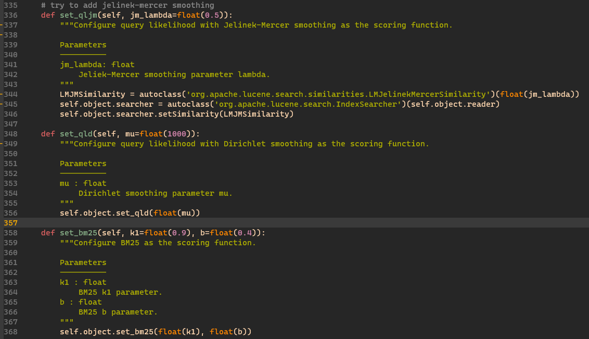

# Demo Repo for 1121_wsm_proj2

Please download WT2G corpus file through the [link](https://drive.google.com/file/d/1EcWOzoftB1BXSntAlJlLC-2I6KY3AgyJ/view)  

### File Tree


### Part1: Language Model (40 queries)
We have 3 ranking function:  
1. bm25
2. dirichlet smoothing
3. jelinek-mercer smoothing

To achieve these methods through pyserini, you have to modify [pyserini/search/lucene/_searcher.py](https://github.com/castorini/pyserini/blob/master/pyserini/search/lucene/_searcher.py).  
Add the following function:  
```python
    def set_qljm(self, jm_lambda=float(0.5)):
        """Configure query likelihood with Jelinek-Mercer smoothing as the scoring function.
        
        Parameters
        ----------
        jm_lambda: float
            Jeliek-Mercer smoothing parameter lambda.
        """
        LMJMSimilarity = autoclass('org.apache.lucene.search.similarities.LMJelinekMercerSimilarity')(float(jm_lambda))
        self.object.searcher = autoclass('org.apache.lucene.search.IndexSearcher')(self.object.reader)
        self.object.searcher.setSimilarity(LMJMSimilarity)
```


### Part2: Learning to Rank
Use part1 results to train a ML model, then test on new 10 queries.  
Example: please refer to sparse_retrieval/codes/random_forest.py

### Usage
After download WT2G corpus and modify [pyserini/search/lucene/_searcher.py](https://github.com/castorini/pyserini/blob/master/pyserini/search/lucene/_searcher.py):  

```bash
cd sparse_retrieval/
./run.sh
```
